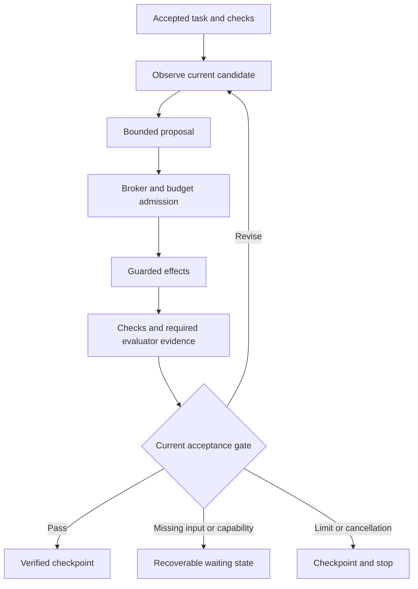

# Loop Engineering for Coding

A portable coding workflow and an implemented native controller for text-capable agents and models.

**Define acceptance → observe → propose one useful step → authorize effects → verify the exact candidate → checkpoint or continue within budget.** The controller owns completion; a model's claim never substitutes for checks.

Version **1.0.0** includes guarded proposals, actual command checks, authenticated evidence/replay, reservations, pause/amendments, model switching, external evaluators, stages, a fail-closed Docker check backend and continuous supervised development teams. Local mode remains operator-supervised. Deployment containment and representative coding performance require separate validation.

Start with **[How to use this project](docs/how-to-use.md)**. The [implementation inventory](docs/implementation-status.md) defines the delivery scope and separate live/deployment prerequisites.

## Start a development project

Use Loop inside the App/CLI conversation with a one-time project connection:

```bash
.venv/bin/python scripts/loop.py host-install /absolute/path/to/your-project \
  --state-dir /absolute/private-state --host codex
```

Open/trust the project and reconnect its MCP tools in Codex App or CLI, then
say: **“Use $loop-engineering. Read the project docs, collect requirements,
coordinate the specialists, and show progress in this chat.”** The current host
operates Loop's tools; the user supplies requirements and answers. Actual
controller stages, tasks, checks and blockers are available in a refreshing
local progress page. `--host claude-code` installs its project skill/MCP entry;
`--host claude-desktop` exports its entry and instructions for client registration.
See [对话式入口与进度](docs/native-host.zh-CN.md) for setup, evidence and recovery limits.
Native host usage is outside scheduler accounting, with unknown spend; required
hard caps/evaluators remain enforced as admission/completion blockers. An
unfinished `team-run` team retains its existing route until explicitly stopped.

The separately scheduled CLI route remains available:

Start with an idea or existing docs by calling the requirements agent first:

```bash
.venv/bin/python scripts/loop.py setup /absolute/path/to/your-project \
  --state-dir /absolute/private-state --adapter codex
```

The setup assignment uses `requirements_reviewer` in a separate request. It
reads bounded project documents, asks material questions and prepares
`.loop/spec.md`, then stops before development. Answer with `team-answer` and
continue `setup --team-id`; when ready, use `team-run --team-id` to keep the same
answers and cumulative budget. Without `--adapter`, `setup` only exports
`.loop/setup.md` for your coding host. [需求采集指南](docs/requirements-setup.zh-CN.md)
describes both routes and limits.

The **development scenario** supplies a sixteen-role library. Its coordinator
selects a team from your spec: requirements, design, architecture, frontend,
backend, testing, security, performance, review and acceptance, plus integration,
DevOps, database, documentation and reliability specialists when needed.
Selection records explain each role's activation, coverage or non-applicability.
Six core responsibilities remain required; small projects can combine permitted
roles while retaining independent review and acceptance. You provide the spec
and answers; the coordinator prepares team/task contracts and checks.

After installing the environment below, initialize an existing project directory:

```bash
.venv/bin/python scripts/loop.py init /absolute/path/to/your-project \
  --scenario development --spec /absolute/path/to/spec.md
.venv/bin/python scripts/loop.py team-run /absolute/path/to/your-project \
  --state-dir /absolute/private-state --adapter codex
```

`team-run` requires the selected host, such as an installed authenticated Codex
CLI. The coordinator prepares tasks from the spec, schedules isolated workers,
checks and integrates outputs, performs separate review requests and handles
bounded repair. All operations share cumulative time/dispatch/usage accounting.
Answer blocking questions with `team-answer`, then continue the same team ID.
See [continuous team execution](docs/team-execution.md) for commands and limits.

The controller supplies source-linked [role memory](docs/team-memory.zh-CN.md)
at each stage: actual answers, relevant tasks, repairs and check/handoff indexes.
Inspect it offline with `team-memory TEAM_ID --state-dir /absolute/private-state`.
Continue the same team ID to keep records and cumulative budgets across restarts.

Setup alone dispatches no models. You can also open the project in a coding host
and say: **“Read `.loop/start.md` and develop the spec; coordinate the team and
ask me only material questions.”** This portable route uses the host's actual
tools. Claude Desktop also has a [native MCP handoff](docs/desktop-mcp.md)
with a separate Codex reviewer. [重新设置开发团队](docs/reinitialize.zh-CN.md)
provides backup-preserving reset and setup commands.
The [专业 agent 说明](docs/development-agents.zh-CN.md) covers each role's
professional procedure, automatic covered responsibilities and evidence boundaries.
Native teams can explicitly configure a [fresh independent Codex reviewer](docs/native-review.zh-CN.md)
without replacing frozen tasks. The progress page distinguishes runnable checks,
external signed imports and missing authority before final acceptance.
Omit `--spec` to provide requirements in that conversation.

## Try it offline

Python 3.11+ and one schema dependency:

```bash
python3 -m venv .venv
.venv/bin/python -m pip install -r requirements-dev.txt
.venv/bin/python scripts/demo_local.py
.venv/bin/python scripts/demo_native.py
.venv/bin/python scripts/demo_team_corpus.py
```

The local demo rejects an overbroad bug fix and verifies a focused fix. The native demo uses two synthetic provider protocols, retains unknown spend after interruption, switches context/model, verifies stages, imports a signed reviewer fixture, audits replay, and restores the candidate. Source changes, check processes, hashes and journal operations are real; proposals, usage, prices and review judgment are scripted. No model or Docker call is made by these demos.

## Choose a route

| Route | Use it for | Enforcement |
| --- | --- | --- |
| Development scenario | Supply a spec and select a host for a specialist team | Continuous supervised scheduling, isolated parallel copies, cumulative budgets, verification, repair and recipient gates; manual host route also available |
| Portable workflow | An existing coding agent, editor or human working with a chat model | The identified human/host follows `LOOP.md`, task and handoff |
| Local file/CLI bridge | Any model returning AgentStep JSON; optional existing-agent wrappers | Guarded edits, real checks, durable state; operator supervision |
| Native engine | A controller owning inference, effects, budgets and acceptance | Direct text drivers, typed broker, authenticated records, runtime capability checks |

Any capable text model can use the file bridge. Direct drivers currently support OpenAI Responses and Anthropic Messages. New drivers implement the same contract; image/tool/session features are capability-dependent. This does not guarantee equal task performance or certify every agent product.

Use `scripts/loop.py init /path/to/project`, or add `--native` for engine configuration. Review the generated task/profile before `doctor` and `start`; store state outside the workspace. Existing files/instructions are preserved. [The guide](docs/how-to-use.md) covers proposals, native configuration, evaluators, stages, recovery and delivery.



## Rules

- Every declared check is required and bound to the exact task, check, candidate and environment.
- The implementer cannot weaken scope/oracles or supply its own successful state/evidence authority.
- Attempts, elapsed work, unknown usage and reservations survive restart and model switching.
- Missing runtime/evaluator/accounting capabilities refuse admission or retain an explicit supervised fallback.
- A verified local result is a checkpoint; release operations require their own integration and authorization.

## Validate the implementation

```bash
.venv/bin/python -m unittest discover -s tests -v
.venv/bin/python scripts/validate_contracts.py
.venv/bin/python scripts/check_readiness.py --for-live-evaluation
.venv/bin/python scripts/demo_local.py
.venv/bin/python scripts/demo_native.py
```

Default CI is offline. The readiness checker reads the reviewed inventory and source references; it does not run tests, dispatch a provider, or attest a deployed runtime. [Evaluation](docs/evaluation.md) links the actual scripted reports and explains later live conformance.

The pure decision core uses only the standard library: `python3 -m reference.demo` and `python3 -m unittest discover -s tests -p test_core.py -v`.

## Read further

| Document | Purpose |
| --- | --- |
| [How to use](docs/how-to-use.md) | Complete operator and project walkthrough |
| [Scenario presets](docs/scenarios.md) | Spec-first development setup and host-orchestrated specialist team |
| [Native rules](docs/native-engine.md) | Implemented authority, lifecycle, budgets, evaluator and durability semantics |
| [Architecture](docs/architecture.md) | Components and state flow |
| [Contracts](docs/contracts.md) | Versions, schemas, actions and replay |
| [Adapters](docs/adapters.md) | Provider/file/agent boundaries and capabilities |
| [Verification](docs/verification.md) | Current-snapshot evidence and completion |
| [Local bridge](docs/local-controller.md) | Existing-agent compatibility and supervised limitations |
| [Implementation status](docs/implementation-status.md) | Reviewed completion scope and remaining deployment/live validation |

## Design references

This is an original implementation, not a benchmark proving one workflow best. [Loop Engineering](https://github.com/cobusgreyling/loop-engineering) motivates bounded repository operations and persistent state. [Superpowers](https://github.com/obra/superpowers) illustrates composable coding methodology. [Anthropic's long-running harness account](https://www.anthropic.com/engineering/effective-harnesses-for-long-running-agents) motivates incremental work and behavioral verification. [ACP](https://agentclientprotocol.com/protocol/v1/initialization) and [MCP](https://modelcontextprotocol.io/specification/2025-11-25) are optional transports; neither replaces the controller's task, authorization or evidence rules.

依赖准备、浏览器交互验证、HTTP 性能检查和新版文件操作的配置方法见[执行工具与重新设置指南](docs/execution-tools.zh-CN.md)。
