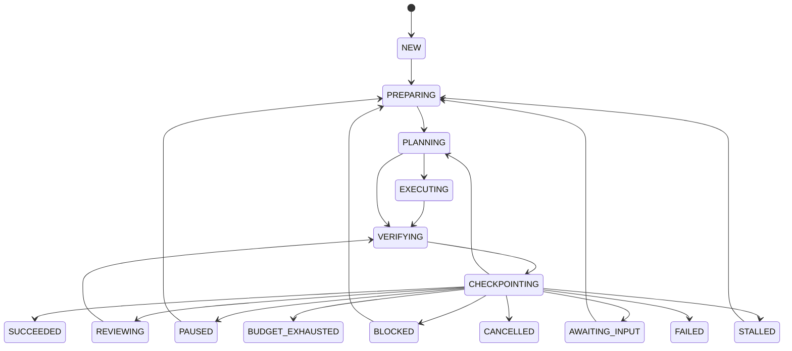

# Architecture

The framework supports a portable workflow, a supervised local bridge, and the implemented native engine. [Native rules](native-engine.md) specify enforcement/failure behavior; [how to use](how-to-use.md) gives commands. Code/offline completion and deployed runtime/live model conformance are separate claims.

## Components

| Component | Owns | Code |
| --- | --- | --- |
| Contract validator | Authorized task/profile identity, scope and check semantics | `contracts.py`, `native_contracts.py` |
| Controller | Lifecycle, completion, counters, pause, amendments, dispatch | `controller.py`, `native_engine.py` |
| Context builder | Mandatory instructions, bounded source/history, stages, findings and budget | `native_engine.py` |
| Model/agent driver | Provider translation or bounded proposal exchange | `models.py`, `adapters.py` |
| Broker | Typed action, actor/lease/scope/check admission and result attribution | `broker.py` |
| Runtime | Owned local processes or protected named-container checks | `processes.py`, `runtime.py` |
| Workspace | Actual-byte manifests, guarded edits and recoverable materialization | `workspace.py` |
| Collector/evaluator boundary | Check results, registered judgment and immutable artifact import | `authority.py`, `evaluators.py` |
| Spend ledger | Pre-dispatch reservations, known usage and unknown holds | `budgets.py` |
| Stage scheduler | Sequential dependency graph, criterion ownership and integrated acceptance | `stages.py` |
| State/replay store | Atomic projection/events, keys, artifacts, fencing and reconstruction | `store.py` |
| Completion gate | Deterministic current-evidence decision | `reference/core.py` |

Native models receive text and return proposals; they do not execute tools. The broker runs approved effects. Docker checks receive only a read-only candidate and provisioned dependencies. Local arbitrary subprocesses share the host's authority and remain supervised. Keys/state stay outside the target workspace. Release services, external tool plugins, recurring discovery, distributed leases and parallel writers are optional integrations.

## Lifecycle

The controller checkpoints before stopped/successful states. A separate cancellation signal can interrupt owned work without acquiring its writer lock. Pause is recoverable; cancellation wins. Interrupted `NEW` acceptance can resume preparation. Unknown effects must be inspected/reconciled before implementation continues.

`PASS`, `REVISE`, `NEED_EVIDENCE` and `REJECT` are gate results, not lifecycle states. Only current authenticated passing evidence can lead to `SUCCEEDED`. An explicit native amendment creates the next contract revision without resetting cumulative resources. Cancelled/failed runs need a new run.

## One bounded turn

1. Acquire the run/physical-workspace writer lock and advance its lease fence.
2. Assert frozen task/profile/configuration; honor stop signals and cumulative limits.
3. Reconstruct required context and active stage from persisted state and current bytes.
4. Prepare/count the provider request; atomically reserve conservative spend and an attempt before inference.
5. Normalize usage and strict proposal; retain uncertainty after ambiguous failures.
6. Admit scoped file effects through the broker and persist guarded edit intent before writing.
7. Materialize the exact candidate, execute every approved check, and collect authenticated records/artifacts.
8. Import required registered evaluator evidence on the same candidate/environment.
9. Derive stage/progress/repeat/stall state and evaluate the complete acceptance gate.
10. Rehash and checkpoint success, a useful next step, or a specific waiting/stopped reason.

A final admitted implementation can still verify at the attempt/spend boundary. New dispatch cannot consume reserved verification capacity. Active operation time is charged once, including native preparation/context/checkpoint overhead; normal idle time is excluded, and crash gaps are conservatively charged. External judgment uses registered authorities. The supervised team scheduler dispatches its configured model reviewers and registered local browser/HTTP executors; standalone native runs expose explicit evaluation request/import/run operations. Accounting covers scheduler-owned inference; external accounts and services are not billed or exhaustively identified by this controller.

## Recovery and portability

Content-addressed snapshots preserve dirty/untracked included files with paths, modes, sizes and exclusion policy. Restoration requires a fresh directory. File recovery rolls forward only approved old/new hashes; an intervening user change prevents further writes. Opt-in AgentStep 0.3 extends guarded old/new recovery to deletion and binary bytes. Symlink materialization, mode changes, submodule setup and distributed recovery are unsupported paths with explicit refusal.

A versioned authenticated checkpoint stream reconstructs the complete latest projection, not merely a summary from the conversation. Events/state/checkpoints commit together. Same-user controllers coordinate physical workspaces across state stores and filesystem aliases. Replay detects gaps, conflicts, identity changes and invalid MACs; rebuild advances the fence and preserves unresolved effects/signals.

Model switching builds a new context while preserving task, counters and reservations. Context trimming never removes mandatory task/state/instructions/findings/stage/accounting. The file bridge remains available to other capable models. Capability declarations cannot create containment or evidence trust; actual host probes and later provider conformance determine deployed use.
